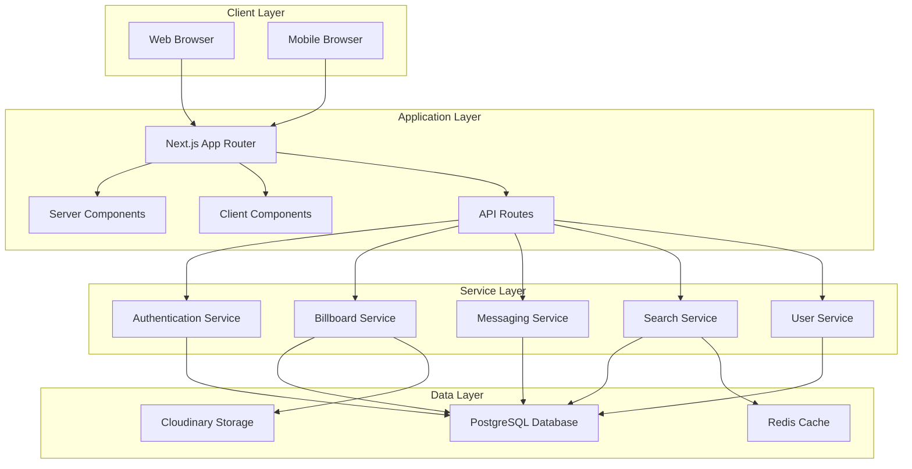
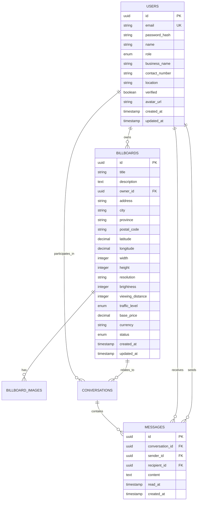

# Design Document

## Overview

The Digital Billboard Marketplace is a modern web application built with Next.js 14, TypeScript, and shadcn/ui components. The platform serves as a comprehensive marketplace connecting digital Out-of-Home (OOH) billboard owners with advertisers in the South African market. The system employs a clean, responsive design with robust search capabilities, secure messaging, and localized features tailored for South African users.

The application follows a component-based architecture with clear separation of concerns, utilizing modern React patterns including Server Components for optimal performance and SEO. The design emphasizes accessibility, mobile responsiveness, and user experience while maintaining security and scalability.

## Architecture

### Technology Stack

**Frontend Framework:**

- Next.js 14 with App Router for server-side rendering and optimal performance
- TypeScript for type safety and developer experience
- React 18 with Server Components and Client Components

**UI Framework:**

- shadcn/ui component library for consistent, accessible UI components
- Tailwind CSS for utility-first styling and responsive design
- Lucide React for consistent iconography

**Form Management:**

- React Hook Form with Zod schema validation for type-safe forms
- @hookform/resolvers for seamless integration

**Data Management:**

- TanStack Table (React Table) for advanced table functionality with sorting, filtering, and pagination
- React Query for server state management and caching
- Zustand for client-side state management

**Authentication & Security:**

- NextAuth.js for authentication with multiple providers
- bcryptjs for password hashing
- JWT tokens for session management

**Database & Storage:**

- PostgreSQL for relational data storage
- Prisma ORM for type-safe database operations
- Cloudinary for image storage and optimization

**Deployment & Infrastructure:**

- Vercel for hosting and deployment
- Environment-based configuration for different stages

### System Architecture



## Components and Interfaces

### Core Components

**1. Authentication Components**

- `LoginForm`: Secure login with email/password validation
- `RegisterForm`: User registration with role selection (Owner/Advertiser)
- `PasswordResetForm`: Password recovery functionality
- `ProfileForm`: User profile management

**2. Billboard Management Components**

- `BillboardListingForm`: Create/edit billboard listings with image upload
- `BillboardCard`: Display billboard information in grid/list views
- `BillboardDetailView`: Comprehensive billboard information display
- `BillboardGallery`: Image carousel for billboard photos

**3. Search and Discovery Components**

- `SearchBar`: Global search with autocomplete
- `FilterPanel`: Advanced filtering by location, price, specifications
- `SearchResults`: Paginated results with sorting options
- `MapView`: Interactive map showing billboard locations

**4. Messaging Components**

- `MessageCenter`: Inbox/outbox message management
- `ConversationThread`: Individual conversation display
- `MessageComposer`: New message creation
- `MessageNotifications`: Real-time message alerts

**5. Data Display Components**

- `DataTable`: Reusable table with sorting, filtering, pagination
- `DashboardStats`: Key metrics and analytics
- `ListingManagement`: Owner's billboard management interface

### Interface Definitions

**User Interface:**

```typescript
interface User {
  id: string;
  email: string;
  name: string;
  role: "OWNER" | "ADVERTISER";
  profile: UserProfile;
  createdAt: Date;
  updatedAt: Date;
}

interface UserProfile {
  businessName?: string;
  contactNumber: string;
  location: string;
  verified: boolean;
  avatar?: string;
}
```

**Billboard Interface:**

```typescript
interface Billboard {
  id: string;
  title: string;
  description: string;
  location: BillboardLocation;
  specifications: BillboardSpecs;
  pricing: BillboardPricing;
  availability: BillboardAvailability;
  images: string[];
  ownerId: string;
  status: "ACTIVE" | "INACTIVE" | "PENDING";
  createdAt: Date;
  updatedAt: Date;
}

interface BillboardLocation {
  address: string;
  city: string;
  province: string;
  postalCode: string;
  coordinates: {
    lat: number;
    lng: number;
  };
}

interface BillboardSpecs {
  width: number;
  height: number;
  resolution: string;
  brightness: number;
  viewingDistance: number;
  traffic: "HIGH" | "MEDIUM" | "LOW";
}
```

**Message Interface:**

```typescript
interface Message {
  id: string;
  conversationId: string;
  senderId: string;
  recipientId: string;
  content: string;
  attachments?: string[];
  readAt?: Date;
  createdAt: Date;
}

interface Conversation {
  id: string;
  participants: string[];
  billboardId?: string;
  lastMessage?: Message;
  createdAt: Date;
  updatedAt: Date;
}
```

## Data Models

### Database Schema

**Users Table:**

```sql
CREATE TABLE users (
  id UUID PRIMARY KEY DEFAULT gen_random_uuid(),
  email VARCHAR(255) UNIQUE NOT NULL,
  password_hash VARCHAR(255) NOT NULL,
  name VARCHAR(255) NOT NULL,
  role user_role NOT NULL,
  business_name VARCHAR(255),
  contact_number VARCHAR(20),
  location VARCHAR(255),
  verified BOOLEAN DEFAULT FALSE,
  avatar_url VARCHAR(500),
  created_at TIMESTAMP DEFAULT NOW(),
  updated_at TIMESTAMP DEFAULT NOW()
);
```

**Billboards Table:**

```sql
CREATE TABLE billboards (
  id UUID PRIMARY KEY DEFAULT gen_random_uuid(),
  title VARCHAR(255) NOT NULL,
  description TEXT,
  owner_id UUID REFERENCES users(id) ON DELETE CASCADE,
  address TEXT NOT NULL,
  city VARCHAR(100) NOT NULL,
  province VARCHAR(50) NOT NULL,
  postal_code VARCHAR(10),
  latitude DECIMAL(10, 8),
  longitude DECIMAL(11, 8),
  width INTEGER NOT NULL,
  height INTEGER NOT NULL,
  resolution VARCHAR(50),
  brightness INTEGER,
  viewing_distance INTEGER,
  traffic_level traffic_enum,
  base_price DECIMAL(10, 2),
  currency VARCHAR(3) DEFAULT 'ZAR',
  status billboard_status DEFAULT 'PENDING',
  created_at TIMESTAMP DEFAULT NOW(),
  updated_at TIMESTAMP DEFAULT NOW()
);
```

**Messages Table:**

```sql
CREATE TABLE messages (
  id UUID PRIMARY KEY DEFAULT gen_random_uuid(),
  conversation_id UUID REFERENCES conversations(id) ON DELETE CASCADE,
  sender_id UUID REFERENCES users(id) ON DELETE CASCADE,
  recipient_id UUID REFERENCES users(id) ON DELETE CASCADE,
  content TEXT NOT NULL,
  read_at TIMESTAMP,
  created_at TIMESTAMP DEFAULT NOW()
);
```

### Data Relationships



## Error Handling

### Error Types and Handling Strategy

**1. Authentication Errors**

- Invalid credentials: Clear error messages without revealing user existence
- Session expiration: Automatic redirect to login with return URL
- Unauthorized access: 403 responses with appropriate messaging

**2. Validation Errors**

- Form validation: Real-time field validation with Zod schemas
- File upload errors: Size, format, and security validation
- Data integrity: Database constraint violations handled gracefully

**3. Network Errors**

- API failures: Retry mechanisms with exponential backoff
- Timeout handling: User-friendly timeout messages
- Offline detection: Graceful degradation for offline scenarios

**4. Business Logic Errors**

- Duplicate listings: Prevention and clear messaging
- Insufficient permissions: Role-based access control
- Resource not found: 404 handling with helpful navigation

### Error Boundary Implementation

```typescript
interface ErrorBoundaryState {
  hasError: boolean;
  error?: Error;
}

class GlobalErrorBoundary extends Component<
  PropsWithChildren<{}>,
  ErrorBoundaryState
> {
  constructor(props: PropsWithChildren<{}>) {
    super(props);
    this.state = { hasError: false };
  }

  static getDerivedStateFromError(error: Error): ErrorBoundaryState {
    return { hasError: true, error };
  }

  componentDidCatch(error: Error, errorInfo: ErrorInfo) {
    console.error("Global error caught:", error, errorInfo);
    // Log to error reporting service
  }

  render() {
    if (this.state.hasError) {
      return <ErrorFallback error={this.state.error} />;
    }

    return this.props.children;
  }
}
```

## Testing Strategy

### Testing Pyramid

**1. Unit Tests (70%)**

- Component testing with React Testing Library
- Utility function testing with Jest
- Form validation testing with Zod schemas
- API route testing with Next.js test utilities

**2. Integration Tests (20%)**

- Database integration with test database
- API endpoint testing with Supertest
- Authentication flow testing
- File upload and processing testing

**3. End-to-End Tests (10%)**

- Critical user journeys with Playwright
- Cross-browser compatibility testing
- Mobile responsiveness testing
- Performance testing with Lighthouse

### Test Implementation Examples

**Component Testing:**

```typescript
import { render, screen, fireEvent, waitFor } from "@testing-library/react";
import { BillboardListingForm } from "@/components/billboard/BillboardListingForm";

describe("BillboardListingForm", () => {
  it("should validate required fields", async () => {
    render(<BillboardListingForm />);

    const submitButton = screen.getByRole("button", {
      name: /create listing/i,
    });
    fireEvent.click(submitButton);

    await waitFor(() => {
      expect(screen.getByText(/title is required/i)).toBeInTheDocument();
      expect(screen.getByText(/location is required/i)).toBeInTheDocument();
    });
  });
});
```

**API Testing:**

```typescript
import { createMocks } from "node-mocks-http";
import handler from "@/pages/api/billboards";

describe("/api/billboards", () => {
  it("should create a new billboard", async () => {
    const { req, res } = createMocks({
      method: "POST",
      body: {
        title: "Test Billboard",
        location: "Cape Town, South Africa",
        // ... other required fields
      },
    });

    await handler(req, res);

    expect(res._getStatusCode()).toBe(201);
    expect(JSON.parse(res._getData())).toMatchObject({
      title: "Test Billboard",
      location: "Cape Town, South Africa",
    });
  });
});
```

### Continuous Integration

- GitHub Actions for automated testing
- Pre-commit hooks for code quality
- Automated security scanning
- Performance regression testing
- Accessibility testing with axe-core

The testing strategy ensures high code quality, prevents regressions, and maintains system reliability while supporting rapid development cycles.
